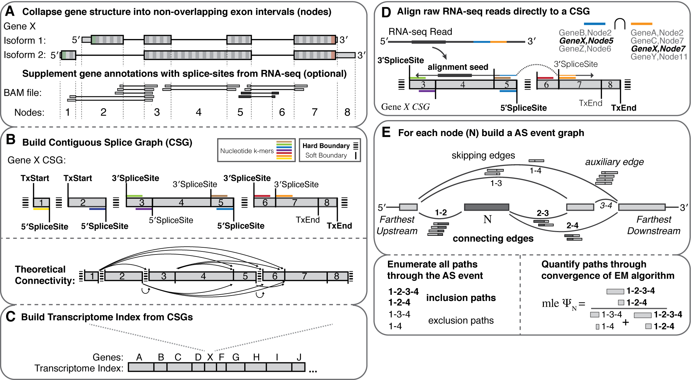

.. _whippet:
  
=======================================================
Whippet: a fast and accurate tool for AS quantification 
=======================================================

Whippet is a fast, lightweight and accurate method for quantifying alternative splicing. Given an input gene annotation file on a `GTF format <https://www.ensembl.org/info/website/upload/gff.html>`_, Whippet builds contiguous splice graphs (CSGs) to represent each transcript. Each CSG node represents a non-overlapping exonic sequence, while edges represent splice junctions or contiguous exonic regions. By mapping reads directly to the CSG, Whippet enables a fast annotation-oriented quantification of splicing events.

   Figure 1: An overview of Whippet’s computational workflow to quantify alternative splicing events. A. ​Illustration of Whippet’s Node assignment given an example gene annotation with two isoforms. ​B. Representation of the CSG model that would be built given the example gene annotation provided above. ​C. Transcriptome indexing from CSGs generated for each annotated gene. ​D. Read alignment to the indexed transcriptome. E. Alternative splicing quantification through node PSI estimation, which takes into account the full set of RNA-seq reads aligned to edges that connect or exclude the corresponding splicing nodes. This figure was taken from `Whippet's github repository <https://github.com/timbitz/Whippet.jl>`_. For further information about the mode can be found at their publication `Sterne-Weiler et al. 2018 <https://doi.org/10.1016/j.molcel.2018.08.018>`_.

